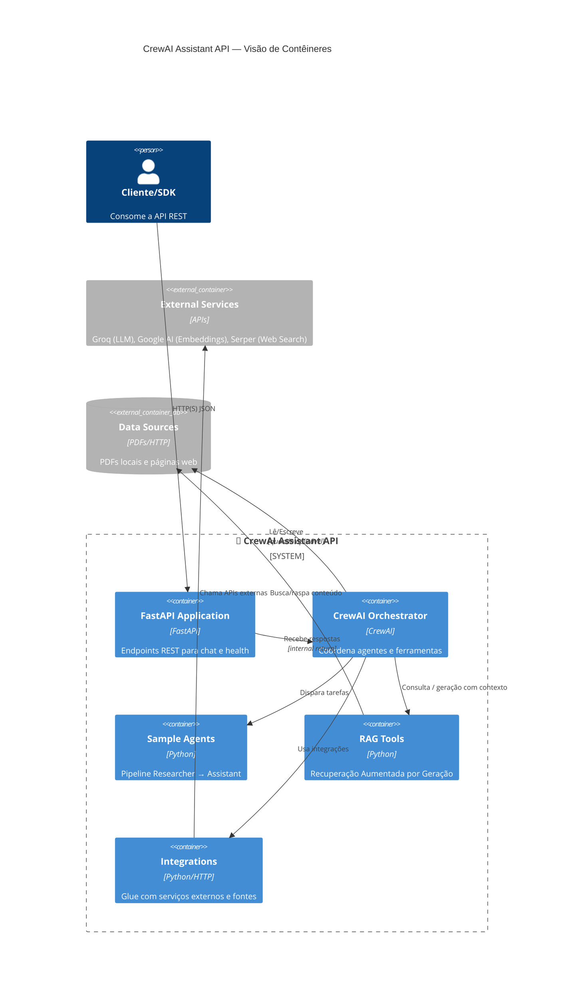
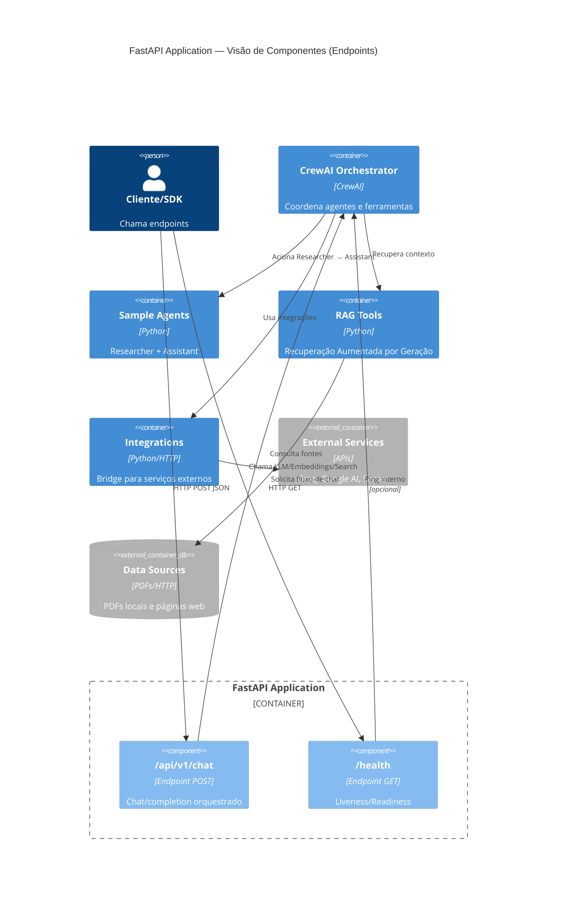

# Arquitetura C4 Model

Este documento apresenta a arquitetura da aplicação **CrewAI Assistant API** utilizando o modelo C4, que descreve sistemas de software em diferentes níveis de abstração: Contexto, Contêineres, Componentes e Código.

## Visão de Contêineres

A visão de contêineres mostra os principais componentes tecnológicos (contêineres) do sistema e suas interações de alto nível.

## Visão de Componentes

A visão de componentes detalha os componentes internos da aplicação FastAPI, focando nos endpoints e suas interações.

